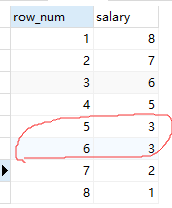
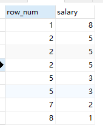
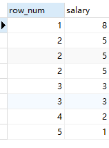
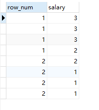

 

#  基础语法


Insert, update, delete 比较特殊，需要单独记忆:

\1.    **Insert into** TableName (s1, s2, s3…) **Values** (v1, v2, v3 …)

\2.    **Update** TableName **set** ColumnName = “v1” **where** ColumnName = “v2”

\3.    **Delete** **from** TableName **where** ColumnName = “v1”

 

Top: **Limit** num 

选择前三个 跳过第一个

 ```mysql
Select * from table

Limit 1, 3 

Limit 3, offset 1
 ```


#  JOIN相关


Left/right join：以左表为基准开始join，右边会出现空


Inner join：无空

Full join: 左右都会出现空

 


#  部分特殊语法


## 如果查询值可为空

```mysql
Select ifnull (

    (Select * from table),

    Null
)
```


## if函数

 ```mysql
If (condition, true , false )
 ```


## case when函数

```mysql
Case when condition then value1 

When condition then value2 
   …   
   
When condition then value3 end
```


## 排序

### row_number

在排名时序号连续不重复

```mysql
select row_number() OVER (order by salary desc) from table
```



### rank

排序重复时不会连续，相同的一样

```mysql
select rank() over(order by salary desc) from table
```



### dense_rank

排序是连续的，相同的一样

```mysql
select dense_rank() over(order by salary desc) from table 
```




### NTILE

NTILE(N) 会分成N组

```mysql
select NTILE(2) over(order by salary desc) from table 
```


