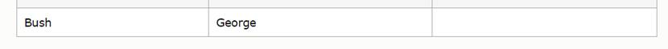

 

#  基础语法

Insert, update, delete 比较特殊，需要单独记忆:

\1.    **Insert into** TableName (s1, s2, s3…) **Values** (v1, v2, v3 …)

\2.    **Update** TableName **set** ColumnName = “v1” **where** ColumnName = “v2”

\3.    **Delete** **from** TableName **where** ColumnName = “v1”

 

Top: **Limit** num 

选择前三个 跳过第一个

Select * from table

**Limit** 1, 3 

**Limit** 3, **offset** 1

 

#  JOIN相关

Left/right join：以左表为基准开始join，右边会出现空

Inner join：无空

Full join: 左右都会出现空

 

#  部分特殊语法

**Select if null** (

​    (Select * from table),

​    Null

)

 

**If** (condition, true value, false value)

 

**Case when** condition **then** value1 

**When** condition **then** value2 

​    …   

**When** condition **then** value3 **end**

