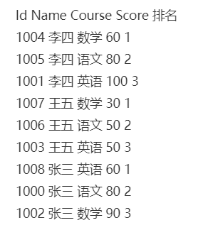

 

#  基础语法


## Insert, update, delete 

比较特殊，需要单独记忆:

 ```mysql
insert into TabelName (s1,s2,s3) Values (v1,v2,v3)
 ```

```mysql
Update TabelName set ColumnName = 'v1' where columnName = 'v2'
```

```mysql
delete from TableName where ColumnName = 'v1'
```


## Top排序: Limit

选择前三个 跳过第一个

 ```mysql
Select * from table

Limit 1, 3 

Limit 3, offset 1
 ```


## 判断字段是否为空：IS NULL

```mysql
select * from TableName where Address is null  
```

```mysql
select * from TableName where Address is not null
```


## 分组：Gourp By , Having

Group by 分组

where无法与Group by连用 引用having

```mysql
select sum(value1) from TableName 
where value3 > 3000 
Group By Id 
Having sum(value2) < 2000
```


##  JOIN

Left/right join：以左表为基准开始join，右边会出现空


Inner join：无空

Full join: 左右都会出现空

 

## 日期算法

```mysql
select datediff(endDate, firstDate)
```


## 取整，整除

num为小数位

```mysql
round(values,num)
```

num为除数

```mysql
mod(values,num)
```


## 创建新窗口：with as 

```mysql
with temp as(select * from table )
```


#  部分特殊语法


## 如果查询值可为空

ifnull 只能接收一个值

```mysql
Select ifnull (

    (Select one_value from table),

    Null
)
```


## if函数

 ```mysql
If (condition, true , false )
i.e. SELECT IF(500<1000, 5, 10)
 ```


## case when函数

```mysql
Case when condition then value1 

When condition then value2 
   …   
   
When condition then value3 end
```


## 排序

### partition by

分组函数

```mysql
select *, ROW_NUMBER() over(partition by Name order by Score) from table
```




### row_number

在排名时序号连续不重复

```mysql
select row_number() OVER (order by salary desc) from table
```


### rank

排序重复时不会连续，相同的一样

```mysql
select rank() over(order by salary desc) from table
```


### dense_rank

排序是连续的，相同的一样

```mysql
select dense_rank() over(order by salary desc) from table 
```


### NTILE

NTILE(N) 会分成N组

```mysql
select NTILE(2) over(order by salary desc) from table 
```


