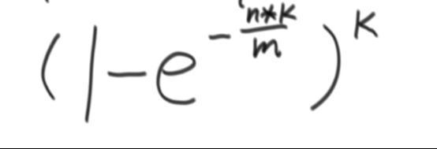

## 递归复杂度

T(N) = aT(N/b) + O(n ** d) 

N 为样本量

a 为发生次数

b 为切割后的样本量

O(n ** d) 是切割后单次的复杂度

i.e.

t.py中 a = 2 b =2 d = 0

复杂度为O(N ^ log(b, a) ) = O(N) 

## 堆

数组可以转换为完全二叉树：

i 左叶节点： 2 * i + 1 

  右叶节点：2 * i + 2

  父节点：i -1 /2

# 排序的稳定性

稳定性：相同的数字稳定排序

bubble insert merge 做得到

select quick heap 做不到  

# 哈希表相关

哈希函数：

将一个数 经过哈希计算后 mod N 然后存入1-n的桶内 用链表形式

两张哈希表：表A 存 value -> index (第几次存入) 表B 存 index-> value 

random 从表b 随机index取出 value

删除时用 用表A 取出index 最后一条填补删除处 然后

单表结构： 删除时，把删除位置的值和最后一个位置的值调换 然后删掉最后一个  size -1 

# 布隆过滤器

用作大数据中寻找单数据

数据 经过K个哈希函数 求出的值存放在 bit数组里 置为1 ： 进入过布隆过滤器

所有数据进入过布隆过滤器之后

将目标数据经过相同的哈希函数 如果都在布隆过滤器的数组中 ：目标

如果只要有一个不在：不是

m : 需要的bit长度 p 失误率

K 个哈希函数

真实失误率

# 递归问题

递归问题的本质就是将问题转换成N-1 的问题，再找出N =1 的时候需要做的事。